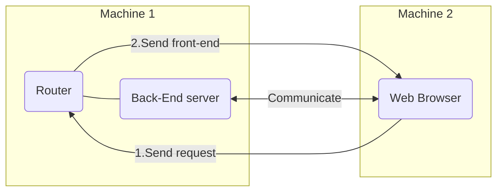

# Nuit de l'info - Les Bases

Bienvenue sur ce repository qui vous permettra de vous exercer et d'acquérir de multiple connaissances et compétences sur le WEB afin de ne pas être perdu lors du top départ de la nuit de l'info.

## Qu'est ce que le WEB ?

Tout d'abord, effectuons une présentation rapide d'un environnement web.
En général, un environnement web est composé de trois éléments essentiels: le back-end, le front-end et le routeur.
- Le back-end est la partie "serveur" de l'environnement. Celui-ci permet de récolter des données, d'en enregistrer et de les partager avec un ou plusieurs clients. Le back-end peut-être codé en divers langages tel que JavaScript, PHP, Python ...
- Le front-end est la partie "interface utilisateur". C'est un ensemble de composants dynamiques ou statiques avec lesquels l'utilisateur pourra intéragir ou non. En WEB, le front-end est lu, interprété, affiché et managé par les navigateurs WEB. Enfin, il est composé de trois languages différents: un langage de description du contenu (HTML) (Qu'est ce que je vais avoir sur ma page WEB ?), un langage de description du style (CSS) (Comment je vais afficher mon contenu ?) et un langage de programmation de scripts (JavaScript) (Qu'est-ce que je vais faire de mon contenu ?)
- Le routeur est l'élément qui va receuillir les requêtes des utilisateurs et leur transmettre le front-end. Celui-ci est présent sur une machine qui possède une adresse IP (adresse qui permet de localiser l'endroit vers lequel il faut envoyer les requêtes) et il communique au travers d'un port (une porte par laquelle il a les permissions de faire passer des informations)

Example:


### 1) Le front-end

Comme dans la majorité des projets WEB, Nous choisirons d'utiliser trois langages pour le front-end qui sont les suivants: HTML, CSS, JavaScript

Ci-dessous, quelques exercices pour s'entraîner en CSS:
- https://flexboxfroggy.com/#fr
- https://flukeout.github.io/
- https://cssgridgarden.com/#fr

Et LE site pour apprendre HTML et JavaScript:
- https://www.w3schools.com/

### 2) Le back-end

Pour le back-end, le choix s'est porté sur Node.js.

Mais qu'est-ce que Node.js ?
Node.js est un framework JavaScript, c'est-à-dire une grande bibliothèque de scripts écrits en JavaScript.

L'avantage de Node.js ?
Node.js est très flexible (permet de faire un peu tout et assez bien), n'a pas besoin de navigateur WEB pour fonctionner même si les scripts sont écrits en JavaScript, et permet l'utilisation du gestionnaire de paquets npm qui permet d'importer des modules (ou librairies) déjà écrites par d'autre développeurs.

Afin d'apprendre le TypeScript:
- https://learn.microsoft.com/en-us/training/paths/build-javascript-applications-typescript/

### 3) Le routeur

Dans Node.js, nous pouvons directement intégrer un routeur. Celui qui a été choisi est Express.

## Et maintenant ?

Il faut décider sur quoi travailler: soit le front-end, soit le back-end. Heureusement, le routeur Express est déjà codé de A à Z, il suffit donc de l'implémenter dans notre scipt Node.js.
Tout d'abord il faut s'exercer en apprenant les langages HTML, CSS et JavaScript (C'est la BASE du WEB). Inutile de connaître toutes les balises HTML ou tous les attributs CSS, il suffit de comprendre le fonctionnement et d'être capable de réaliser un site web statique par soi-même ( un paragraphe, une grille comportant plusieurs couleurs et un bouton intéractif en JavaScript suffiront ;-) )

## Comment utiliser le projet d'exemple de ce repository ?

1) Installer Node.js
> https://nodejs.org/en/download/

2) Installer git
> https://git-scm.com/downloads

3) Cloner ce repository dans votre espace de travail 

> ```git clone [url du repository]```

4) Installer les dependances du projet

> ```npm install```

5) Compiler et démarrer le serveur

> ```npm run dev```

6) Accéder au front-end

> Dans un navigateur web, faire une requête à: ```[adresse routeur]:[port]```
> Si la requête est effectuée sur la même machine que le routeur et sur le port 3000: ```localhost:3000```

## Comment est construit ce projet d'exemple ?

Le projet Node.js du repository est construit de la manière suivante:

 ```
├── dist
│   ├── app.js
│   ├── app.js.map
├── node_modules
├── public
│   ├── api
│   ├── style
│   │   ├── *.css
│   ├── images
│   ├── script
│   │   ├── *.js
│   ├── index.html
├── src
│   ├── app.ts
├── .env
├── package.json
├── package-lock.json 
└── tsconfig.json
 ```

```dist```: répertoire des scripts TypeScript compilés en JavaScript

```node_modules```: répertoire des dépendances du projet archivées

```public```: répertoire du front-end

```public/index.html```: page web principale

```src/app.ts```: script du serveur back-end (en TypeScript) et implémentation du routeur Express

```.env```: variables d'environnement (globales au projet)

```package.json```: description et liste des dépendances du projet

```tsconfig.json```: fichier de description de la compilation des scripts TypeScript en JavaScript

### Quelles sont les commandes ?

Plusieurs commandes ont été créées dans le fichier package.json. Elles sont placées dans "scripts" et permettent de réaliser certaines autres commandes.
On retrouve:
- build: pour compiler les fichier TypeScript en JavaScript
- start: pour lancer le serveur Node.js qui lui-même lance le routeur Express
- dev: qui compile et qui lance le serveur Node.js ( = build+start )
- test: qui permet de tester si Node.js a bien été initialisé dans le projet